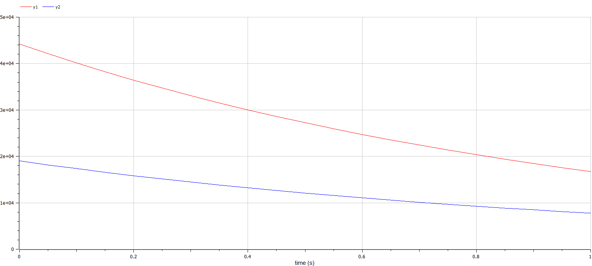
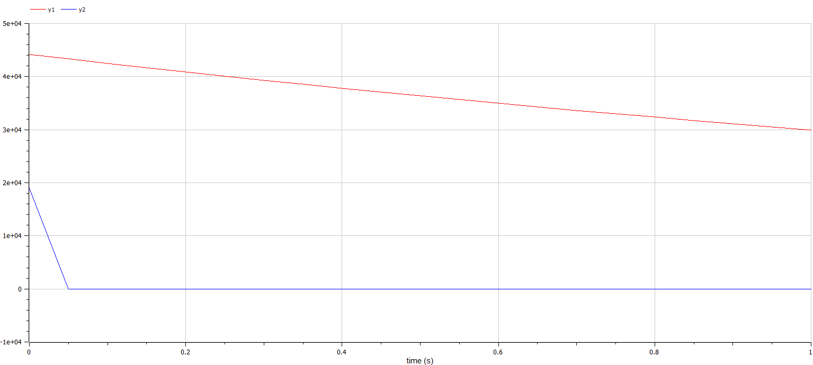

---
## Front matter
lang: ru-RU
title: Модель боевых действий
author: |
	 Гудиева Мадина Куйраевна, НПИбд-01-19\inst{1}

institute: |
	\inst{1}Российский Университет Дружбы Народов

date: 20 мая, 2022, Москва, Россия

## Formatting
mainfont: PT Serif
romanfont: PT Serif
sansfont: PT Sans
monofont: PT Mono
toc: false
slide_level: 2
theme: metropolis
header-includes: 
 - \metroset{progressbar=frametitle,sectionpage=progressbar,numbering=fraction}
 - '\makeatletter'
 - '\beamer@ignorenonframefalse'
 - '\makeatother'
aspectratio: 43
section-titles: true

---

# Цели и задачи работы

## Цель лабораторной работы

Нам необходимо рассмотреть модели простейших боевых действий, так называемые модели Ланчестера. 

В моделях мы будем рассматривать три случая битв: 
1. Сражение регулярных войск.
2. Сражение регулярных и партизанских войск.
3. Сражение партизанских войск.

В основном также будут учитываться следующие характеристики
* численность стороны
* количество убитых с одной стороны бойцом. 
Стоит также заметить, что в случае. если численность армии обращается в нуль, то данная сторона считается проигравшей (при условии, что численность другой стороны в данный момент положительна). 

## Задание к лабораторной работе

1. Изучить текст лабораторной
2. Выявить три случая модели Ланчестера
3. Вывести уравнения для постоения моделей Ланчестера для трех случаев
4. Построить графики изменения численности войск ,учитывая уравнения
5. Определить победившую сторону

# Процесс выполнения лабораторной работы

## Теоретический материал 

Рассмотри три случая ведения боевых действий: 

1. Боевые действия между регулярными войсками
2. Боевые действия с участием регулярных войск и партизанских отрядов
3. Боевые действия между партизанскими отрядами 

## Теоретический материал 

Будем рассматривать три случая ведения боевых действий с учетом различных типов войск: 
1. Боевые действия между регулярными войсками 
2. Боевые действия с участием регулярных войск и партизанских отрядов 
3. Боевые действия между партизанскими отрядами 

## Теоретический материал 

В первом случае модель боевых действий между регулярными войсками описывается следующим образом

$$
 \begin{cases}
	\frac{dx}{dt}= -a(t)x(t) - b(t)y(t) + P(t)
	\\   
	\frac{dy}{dt}= -c(t)x(t) - h(t)y(t) + Q(t)
 \end{cases}
$$

## Теоретический материал 

Во втором случае в борьбу добавляются партизанские отряды. В результате модель принимает вид:

$$
 \begin{cases}
	\frac{dx}{dt}= -a(t)x(t) - b(t)y(t) + P(t)
	\\   
	\frac{dy}{dt}= -c(t)x(t)y(t) - h(t)y(t) + Q(t)
 \end{cases}
$$

## Теоретический материал 

Модель ведение боевых действий между партизанскими отрядами с учетом предположений, сделанных в предыдущем случаем, имеет вид:

$$
 \begin{cases}
	\frac{dx}{dt}= -a(t)x(t) - b(t)x(t)y(t) + P(t)
	\\   
	\frac{dy}{dt}= -h(t)y(t) - c(t)x(t)y(t) + Q(t)
 \end{cases}
$$

## Задача:

Между страной $X$ и страной $Y$ идет война. Численность состава войск исчисляется от начала войны, и являются временными функциями $x(t)$ и $y(t)$
В начальный момент времени страна $X$ имеет армию численностью 44150 человек, а в распоряжении страны $Y$ армия численностью в 19000 человек.
Для упрощения модели считаем, что коэффициенты $a, b, c, h$ постоянны. 
Также считаем $P(t), Q(t)$ непрерывные функции.
Постройте графики изменения численности войск армии $X$ и армии $Y$ для следующих случаев:

## Случай 1. Модель боевых действий между регулярными войсками

$$
 \begin{cases}
	\frac{dx}{dt}= -0.57x(t) - 0.91y(t) + sin(5*t) + 1
	\\   
	\frac{dy}{dt}= -0.31x(t) - 0.2y(t) + cos(3*t) + 2
 \end{cases}
$$

{ #fig:003 width=60% height=60% }

## Случай 2. Модель боевых действий между регулярными войсками

$$
 \begin{cases}
	\frac{dx}{dt}= -0.39x(t) - 0.86y(t) + sin(2*t) + 1
	\\   
	\frac{dy}{dt}= -0.39x(t)y(t) - 0.21y(t) + cos(2*t) + 1
 \end{cases}
$$

{ #fig:004 width=60% height=60% }

# Выводы по проделанной работе

## Вывод

Рассмотрели модели простейших боевых действий, так называемые модели Ланчестера. 
В моделях мы рассмотрели три случая битв: 

1. Сражение регулярных войск.
2. Сражение регулярных и партизанских войск.
3. Сражение партизанских войск.

Проверили как работают модели в этих случаях, построили графики и сделали вывод о том, кто станет победителем в данных случаях.
