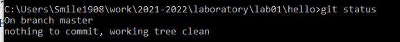
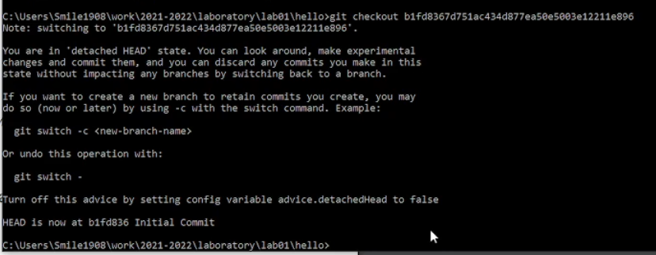
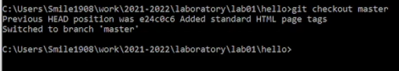
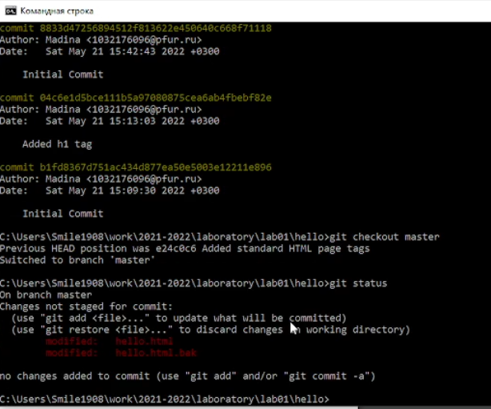
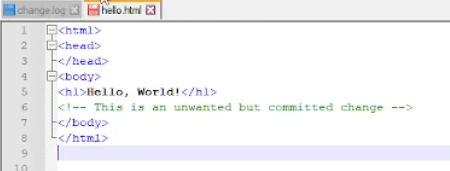
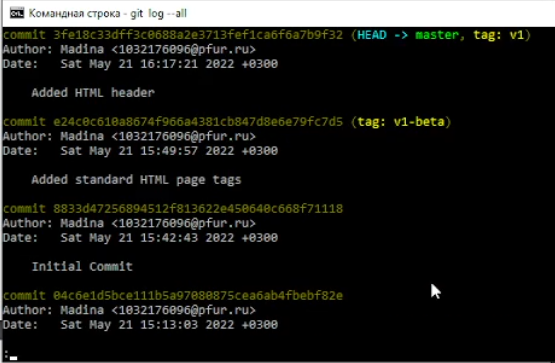
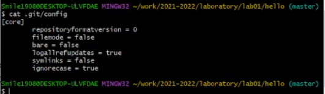
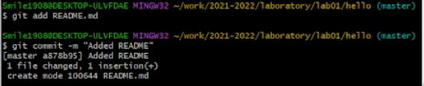
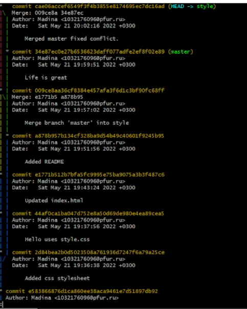

---
## Front matter
title: "Отчет по лабораторной работе №1"
subtitle: "Работа с Git"
author: "Гудиева Мадина Куйраевна"

## Generic otions
lang: ru-RU
toc-title: "Содержание"

## Bibliography
bibliography: bib/cite.bib
csl: pandoc/csl/gost-r-7-0-5-2008-numeric.csl

## Pdf output format
toc: true # Table of contents
toc-depth: 2
lof: true # List of figures
lot: true # List of tables
fontsize: 12pt
linestretch: 1.5
papersize: a4
documentclass: scrreprt
## I18n polyglossia
polyglossia-lang:
  name: russian
  options:
	- spelling=modern
	- babelshorthands=true
polyglossia-otherlangs:
  name: english
## I18n babel
babel-lang: russian
babel-otherlangs: english
## Fonts
mainfont: PT Serif
romanfont: PT Serif
sansfont: PT Sans
monofont: PT Mono
mainfontoptions: Ligatures=TeX
romanfontoptions: Ligatures=TeX
sansfontoptions: Ligatures=TeX,Scale=MatchLowercase
monofontoptions: Scale=MatchLowercase,Scale=0.9
## Biblatex
biblatex: true
biblio-style: "gost-numeric"
biblatexoptions:
  - parentracker=true
  - backend=biber
  - hyperref=auto
  - language=auto
  - autolang=other*
  - citestyle=gost-numeric
## Pandoc-crossref LaTeX customization
figureTitle: "Рис."
tableTitle: "Таблица"
listingTitle: "Листинг"
lofTitle: "Список иллюстраций"
lotTitle: "Список таблиц"
lolTitle: "Листинги"
## Misc options
indent: true
header-includes:
  - \usepackage{indentfirst}
  - \usepackage{float} # keep figures where there are in the text
  - \floatplacement{figure}{H} # keep figures where there are in the text

---

# Цель работы

Научиться работать с Git и Markdown.

# Задание

Сделать отчет по лабораторной работе в формате Markdown.

# Теоретическое введение

##Определение 
Git - это распределённая система управления версиями. 
Проект был создан Линусом Торвальдсом для управления разработкой ядра Linux, первая версия выпущена 7 апреля 2005 года.
###Особенности
Ядро Git представляет собой набор утилит командной строки с параметрами. Все настройки хранятся в текстовых файлах конфигурации. Такая реализация делает Git легко портируемым на любую платформу и даёт возможность легко интегрировать Git в другие системы (в частности, создавать графические git-клиенты с любым желаемым интерфейсом).

Репозиторий Git представляет собой каталог файловой системы, в котором находятся файлы конфигурации репозитория, файлы журналов, хранящие операции, выполняемые над репозиторием, индекс, описывающий расположение файлов, и хранилище, содержащее собственно файлы. Структура хранилища файлов не отражает реальную структуру хранящегося в репозитории файлового дерева, она ориентирована на повышение скорости выполнения операций с репозиторием. Когда ядро обрабатывает команду изменения (неважно, при локальных изменениях или при получении патча от другого узла), оно создаёт в хранилище новые файлы, соответствующие новым состояниям изменённых файлов. Существенно, что никакие операции не изменяют содержимого уже существующих в хранилище файлов.

По умолчанию репозиторий хранится в подкаталоге с названием «.git» в корневом каталоге рабочей копии дерева файлов, хранящегося в репозитории. Любое файловое дерево в системе можно превратить в репозиторий git, отдав команду создания репозитория из корневого каталога этого дерева (или указав корневой каталог в параметрах программы). Репозиторий может быть импортирован с другого узла, доступного по сети. При импорте нового репозитория автоматически создаётся рабочая копия, соответствующая последнему зафиксированному состоянию импортируемого репозитория (то есть не копируются изменения в рабочей копии исходного узла, для которых на том узле не была выполнена команда commit).

# Выполнение лабораторной работы

## 1.1 Подготовка

### 1.1.1 Установка имени и электронной почты

Установила Git, указала имя и почту.

###1.1.2 Параметры установки окончаний строк

Установила параметры окончания строк.

###1.1.3 Установка отображения unicode

Т.к Git по умолчанию будет печатать не ASCII символы, я установила соответствующий флаг, что бы избежать нечитаемых строк.

###1.2.1 Создайте страницу «Hello, World

Создала пустой каталог с именем hello, затем создала там файл hello.html.

###1.2.2 Создание репозитория

С помощью команды Git init я создала git репозиторий. 

###1.2.3 Добавление файла в репозиторий

Добавила созданный ранее мною файл hello в репозиторий.

###1.2.4 Проверка состояние репозитория

С помощью команды git status я проверила текущее состояние репозитория.

###1.3 Внесение изменений
###1.3.1 Измените страницу «Hello, World»

Я изменила содержимое файла hello html и проверила состояние рабочего каталога.

###1.4 Индексация изменений

Чтобы проиндексировать изменения, я выполнила следующую команду, а после снова посмотрела статус. 

###1.4.1 Коммит изменений

Оставила комментарий о том, что добавила h1 tag, и проверила статус.

###1.4.2 Добавьте стандартные теги страницы

Изменила файл Hello, добавив стандартные теги html и body.

Добавила изменение в индекс git.

Добавила заголовки HTML к странице Hello world.

Проверила статус.

Произвела коммит проиндексированного изменения, а затем снова проверила статус. Добавила второе изменение в индекс, проверила статус. Сделала коммит второго изменения.

###1.4.3 История

Получила список произведенных изменений. 

### 1.4.4 Получение старых версий

Получила хэши предыдущих версий. Нашла хэш для первого коммита, проверила содержимой файла hello html. Затем вернулась к последней ветке и снова посмотрела содержимое файла.

### 1.4.5 Создание тегов версий

Создала первый тег версии. 

Далее я перешла на версию, предшествующую нынешней, и назвала ее v1 beta.

###1.4.6 Переключение по имени тега

Попереключалась мсежду отмеченными версиями.

###1.4.7 Просмотр тегов с помощью команды tag

Посмотрела доступные теги. 

### 1.5 Отмена локальных изменений (до индексации)

Перешла на ветку master.

###1.5.2 Измените hello.html

Внесла изменения в файл hello html.

### 1.5.3 Проверила состояние

Проверила состояние каталога.

###1.5.4 Отмена изменений в рабочем каталоге

Использовала команду git checkout для переключения версии файла
hello.html в репозитории.

###1.6 Отмена проиндексированных изменений (перед коммитом)

Изменила файл и проиндексировала это изменение.

###1.6.2 Проверьте состояние

Проверила состояние нежелательного изменения

###1.6.3 Выполнение сброс буферной зоны

Отменила индексацию изменения

###Переключение на версию коммита

##Отмена коммитов
##1.7.2 Отмена коммитов

Я изменила файл и сделала коммит.

###1.7.3 Коммит с новыми изменениями, отменяющими предыдущие

Чтобы отменить коммит, я сделала коммит, который удаляет изменения, сохраненные нежелательным коммитом. Коммит сообщение я не стала менять.

###1.7.4 Проверка лога

##1.8 Удаление коммиттов из ветки
###1.8.3

Чтобы удалтить последние два коммита, я отметила последний тегом, чтобы его можно было потом найти.

###1.8.4 Сброс коммитов к предшествующим коммиту Oops

Сбросила ветку дл ветки, предшествующей ошибочному коммиту.

###1.8.5 Ничего никогда не теряется

Чтобы посмотреть ошибочные коммиты, которые я удалила, я ввела команду git log --all.
К сожалению, я не сделала скриншот и не смогла сделать его из видео, потому что к середине видеозаписи я начала снимать то, что по идее ставила на паузу, вместо того, чтобы снимать выполнение работы.

##1.9 Удаление тега oops
###1.9.1 Удаление тега oops

Я удалила тег oops с помощью сборщика мусора.

##1.10 Внесение изменений в коммиты
###1.10.1 Изменение страницы и коммит

Добавила в страницу комментарий автора. Из-за своей невнимательности я не заметила то, что нужно было указать свою фамилию, и ввела фамилию преподавателя Дмитрия Кулябова.

###E-mail

Включила в страницу e-mail.

###1.10.3 Изменение предыдущего коммита

Чтобы не создавать отдельный коммит только для добавление электронной почты, я изменила предыдущий коммит, включив в него адрес почты.

###1.10.4 Просмотр истории

Посмотрела историю. Коммит "автор" был заменен коммитом "автор/почта"

##1.11 Перемещение файлов

### Перемещение файлов hello в каталог lib

Создание структуры репозитория. Я перенесла  страницу в каталог lib.

##1.12 Второй способ перемещения файлов
###

Я узнала, что вместо прыдудщих коммманд я могла бы использовать следующие для достижения идентичного результата.
mkdir lib
mv hello.html lib
git add lib/hello.html
git rm hello.html

###1.12.1 Коммит в новый каталог

Я сделала коммит перемещения.

##1.13 Подробнее о структуре
###1.13.1 Добавление index html

Я добавила файл index html в репозиторий и сделала коммит.

##1.14 Git внутри: Каталог .git
###1.14.1 Каталог .git

Я просмотрела каталог, в котором хранится вся информация git.

###1.14.2 База данных объектов

Просмотрела набор каталогов.

###1.14.3 Углубляемся в базу данных объектов

Просмотрела файлы, содержащие объекты, хранящиеся в git.

###1.14.4 Config File

Просмотрела файл конфигурации.

###1.14.5 Ветки и теги

Файлы в подкаталоге тегов.

###1.14.6 Файл HEAD

Посмотрела ссылку на текущую ветку (master)

##1.15 Работа непосредственно с объектами git
###1.15.1 Поиск последнего коммита

Посмотрела последний коммит в репозитории.

###1.15.2 Вывод последнего коммита с помощью SHA1 хэша

Вывела последний коммит с помощью хэша.

###1.15.3 Поиск дерева

Вывела дерево каталогов с помощью хэша "дерева".

###1.15.4 Вывод каталога lib

Вывела каталог lib.

###1.15.5 Вывод файла hello.html

Вывела файл hello html.

##1.16 Создание ветки
###1.16.1 Создание ветки

Создала ветку style.

###1.16.2 Добавление файла стилей style.css

Создала файл, отредактировала его и сделала коммит.

###1.16.3 Изменение основной страницы

Чтобы использовать стили style, я обновила файл hello.

После я сделала комммит.

###1.16.4 Изменение index.html

Проделала то же самое для файла index html.

###1.17 Навигация по веткам

Теперь в проекте есть две ветки.

###1.17.1 Переключение на ветку master

Переключилась на ветку master и проверила содержимое.

###1.17.2 Возвращение к ветке style.

Переключилась на ветку style.

##1.18 Изменения в ветке master
###1.18.1 Создание файл README в ветке master

Создала файлы README.

##1.19 Коммит изменений README.md в ветку master.

Сделала коммит изменений.

###1.19.1 Просмотр отличающихся веток
###1.19.2 Просмотр текущей ветки

Просмотрела ветки и их отличия.

##1.20 Слияние
###1.20.1 Слияние веток

Слила master с style.

##1.21 Создание конфликта
###1.21.1 Создание конфликта в master.

Я вернулась в ветку master и внесла изменения в файл lib.

###1.21.2 Просмотр веток

Посмотрела ветки.

##1.22 Разрешение конфликтов
###1.22.1 Слияние master с веткой style

Вернулась к ветке style и попыталась объединить ее с новой веткой master.

###1.22.2 Решение конфликта

Внесла изменения в файл hello html.

###1.22.3 Коммит решения конфликта

Сделала коммит.

###1.22.4 Перебазирование как альтернатива слиянию
##1.23 Сброс ветки style
###1.23.1 Сброс ветки style

Чтобы вернуться на ветке style к точке перед тем, как я слила ее с веткой master, я нашла последний коммит перед слиянием. К сожалению, я не сделала скриншоты, в видео я так же случайно не зафиксирорвала данный этап.

###1.23.2 Проверка ветки.

##1.24 Сброс ветки master
###1.24.1 Сброс ветки master

Вернемся в ветке master в точку
перед внесением конфликтующих изменений.

##1.25 Перебазирование
На этот раз для переноса изменений из ветки master будем использовать
команду git rebase вместо слияния.

###1.25.1 Слияние VS перебазирование
###1.26 Слияние в ветку master

###1.26.2 Просмотр логов

##1.27 Клонирование репозиториев
###1.27.1 Переход в рабочий каталог

Я сдедала клон репозитория.

###1.27.2 Клон репозитория hello

Сделала клон репозитория hello.

##1.28 Просмотр клонированного репозитория
###1.28.1 Взгляд на клонированный репозиторий.

###1.28.2 Просмотр истории репозитория

###1.28.3 Удаленные ветки

##1.29 Что такое origin?

##1.30 Удаленные ветки
Посмотрела на ветки, доступные в нашем клонированном репозитории.

###1.30.1 Список удаленных веток

Посмотрела все ветки.

##1.31 Изменение оригинального репозитория
###1.31.1 Внесение изменения в оригинальный репозиторий hello

Изменила файл README и сделала коммит.

###1.31.2 Извлечение изменений
Выполнила:
cd ../cloned_hello
git fetch
git log --all

На данный момент в репозитории есть все коммиты из оригинального репозитория, но они не интегрированы в локальные ветки клонированного репозитория.
Выводом является то, что команда git fetch будет извлекать новые коммиты из удаленного репозитория, но не будет сливать их с вашими наработками в
локальных ветках.
###Проверка README.md

Выполните:
cat README

Файл не изменился.

##1.32 Слияние извлеченных изменений
###1.32.1 Слияние извлеченных изменения в локальную ветку master
Выполнила:
git merge origin/master
###1.32.2 Еще одна проверка файл README.md

Выполнила:
cat README.md

Есть изменения.

##1.33 Добавление ветки наблюдения
Ветки, которые начинаются с remotes/origin являются ветками оригинального
репозитория. 
###1.33.1 Добавление локальной ветку, которая отслеживает удаленную ветку
Выполнила:
git branch --track style origin/style
git branch -a
git log --max-count=2
Теперь мы можем видеть ветку style в списке веток и логе.

##1.34 Чистые репозитории
###1.35 Создание чистого репозитория.

Я создала чистый репозиторий.

##1.36 Добавление удаленного репозитория

Добавила репозиторий hello.git к оригинальному репозиторю.

##1.37 Отправка изменений

Так как чистые репозитории, как правило, расшариваются на каком-нибудь сетевом сервере,  необходимо отправить изменения в другие репозитории.
Я отредактируйте файл README.md и
сделала коммит.

##1.38 Извлечение общих изменений

Быстро переключилась в
клонированный репозиторий и извлекла изменения, только что отправленные в
общий репозиторий.

##Выводы

В результате данной работы я научилась работать с git и файлами markdown.

# Список литературы{.unnumbered}

::: {#refs}
:::